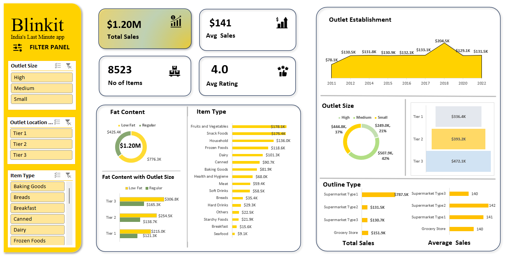

# 📦 Blinkit Real-Time Sales & Outlet Analysis (Excel Dashboard)

## 🧾 Project Overview

This project showcases an Excel-based interactive dashboard designed to analyze real-time sales and outlet performance data for Blinkit, a hyperlocal delivery platform. It focuses on transforming raw retail data into actionable insights that support strategic decision-making in areas such as outlet expansion, product assortment, and customer behavior.

---

## 🎯 Objectives

- Visualize and monitor total sales, average sales, item count, and customer ratings
- Analyze performance by **Outlet Size**, **Tier Location**, and **Establishment Year**
- Evaluate product-wise sales trends across multiple categories
- Explore the impact of **Fat Content** on consumer choices
- Compare sales and average transaction size by **Outlet Type**

---

## 📊 Key Dashboard Features

- **KPI Metrics**:
  - Total Sales: `$1.20M`
  - Number of Items: `8523`
  - Average Sales: `$141`
  - Average Rating: `4.0`

- **Interactive Filters**:
  - Outlet Size (High, Medium, Small)
  - Outlet Tier (Tier 1, 2, 3)
  - Item Type (e.g., Fruits, Dairy, Frozen Foods)

- **Visual Elements**:
  - Line chart for outlet establishment trend (2011–2022)
  - Donut chart for Fat Content breakdown
  - Bar charts for Item Type and Tier-wise sales
  - Pie chart for outlet size contribution
  - Comparative analysis by outlet type (Supermarket, Grocery Store)

---

## 🛠️ Tools & Techniques Used

### Excel Features:
- Pivot Tables & Pivot Charts
- Slicers for real-time filtering
- Dynamic formulas: `SUMIFS`, `COUNTIFS`, `AVERAGEIFS`
- Conditional Formatting for trend highlighting
- Clean layout with professional formatting and visual hierarchy

---

## 📈 Business Use Cases

- Identify top-performing outlet locations and sizes
- Determine best-selling product categories and customer preferences
- Evaluate the effect of outlet age on performance
- Assist in inventory planning and promotional targeting
- Provide a data-driven foundation for strategic decisions in sales and operations

---

## 📁 Project Files

- `Blinkit_Excel_Dashboard.xlsx` — Fully interactive Excel dashboard
- `preview.png` — Screenshot of the dashboard interface
- `README.md` — Documentation and project overview

---

## 📷 Preview

---

## 📌 Note

This project is built entirely in Microsoft Excel to demonstrate the power of spreadsheet tools in business analytics. It serves as a practical example of how Excel can be used beyond basic calculations to create enterprise-level dashboards.

---

